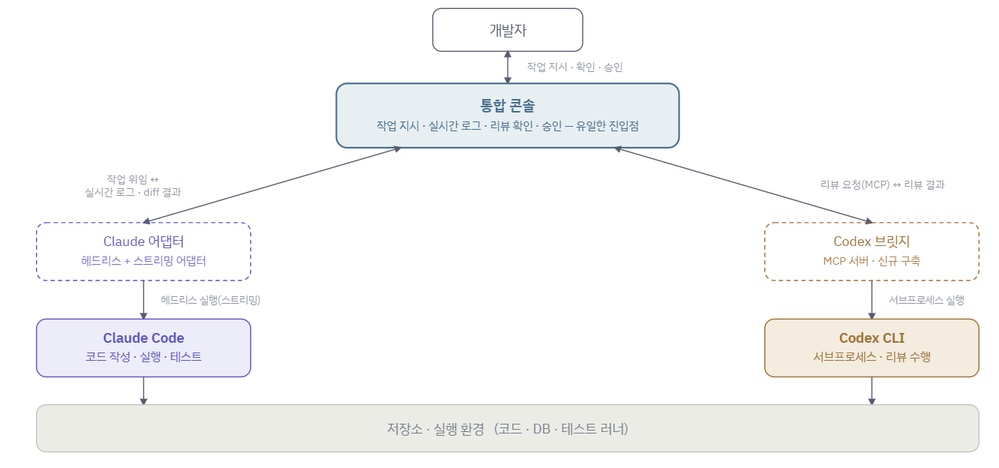
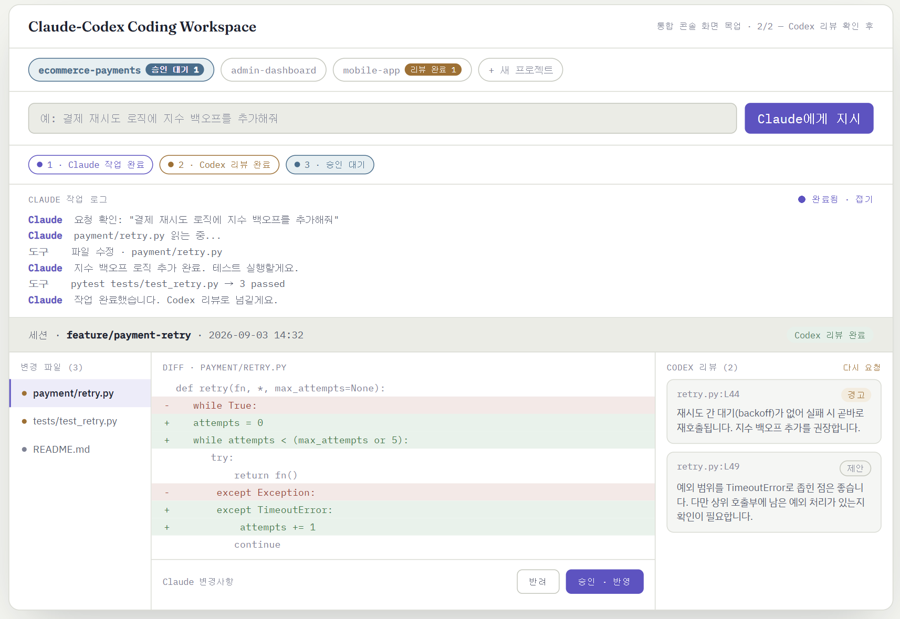

# Claude-Codex Coding Workspace

## 목적
Claude Code와 Codex를 별도의 터미널이나 애플리케이션에서 번갈아 사용하는 불편을 줄이고, 하나의 통합 콘솔에서 두 에이전트를 역할에 따라 병행 사용하는 멀티 에이전트 개발 환경을 구축한다.

## 아키텍처
통합 콘솔 상에서 Claude Code를 주 개발 에이전트로 활용하고, Codex를 코드 리뷰 에이전트로 활용함으로써 단일 모델 의존도를 낮춘다.

- Claude에게는 작업 요청 → 작업이 끝나면 코드의 변경 사항(diff)과 작업 내용을 콘솔에서 확인
- Codex에게는 Claude가 작성한 코드에 대한 리뷰를 MCP로 요청 → 코드 리뷰를 콘솔에서 확인 후 diff 승인/반려

## 화면 구성

## 사용 흐름
1. 콘솔에 Claude에게 요청할 작업을 입력한다.
2. Claude가 지시받은 작업을 수행한다.
3. 변경된 코드(diff)가 콘솔에 표시된다.
4. 코드 리뷰가 필요한 경우 Codex에게 리뷰를 요청한다.
5. Codex 리뷰 결과가 콘솔에 표시된다.
6. 변경된 코드의 승인/반려를 선택한다.

## 향후 확장
- 승인/반려 및 코드리뷰 이력 기록
- 프로젝트별로 코드 리뷰 기준을 별도 설정