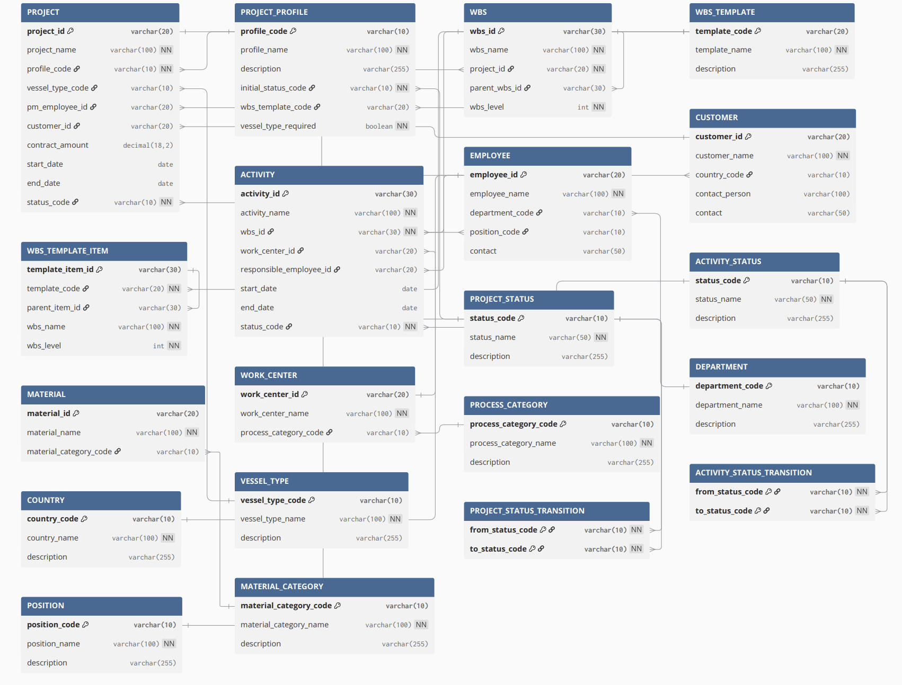

## Project 속성정보
| 속성 | 설명 | 참조 |
| --- | --- | --- |
|프로젝트 ID| 프로젝트 고유 ID| - |
|프로젝트명|프로젝트 이름|-|
|프로젝트 프로파일|프로젝트 유형|Project Profile Master|
|선박 타입|건조할 선박 종류|Vessel Type Master|
|프로젝트 관리자|프로젝트 담당 PM|Employee Master|
|발주처|프로젝트를 발주한 고객사|Customer Master|
|계약 금액|프로젝트 계약 금액|-|
|프로젝트 시작일|시작일|-|
|프로젝트 종료일|종료일|-|
|프로젝트 상태|CRTD/REL/TECO/CLSD|Project Status Master|

## Project Profile 속성정보
|속성|설명|참조|
|---|---|---|
|Profile Code|프로파일 고유 코드|-|
|Profile Name|프로파일 이름|-|
|Description|설명|-|
|Initial Status|프로젝트 생성 시 초기 상태|Project Status Code Master|
|WBS Template|기본 WBS 구조|WBS Template|
|Vessel Type Required|선박 타입 입력 필요 여부|-|

## WBS 속성 정보
|속성|설명|참조|
|---|---|---|
|WBS ID|WBS 고유 ID|-|
|WBS Name|WBS 이름|-|
|Project ID|소속 프로젝트|Project|
|Parent WBS ID|상위 WBS|WBS|
|WBS Level|계층 수준|-|

## WBS Template 속성 정보
|속성|설명|참조|
|---|---|---|
|Template Code|WBS Template 고유 코드|-|
|Template Name|Template 이름|-|
|Description|Template 설명|-|

## WBS Template Item 속성정보
|속성|설명|참조|
|---|---|---|
|Template Item ID|Template WBS 항목 고유 ID|-|
|Template Code|소속 Template|WBS Template|
|Parent Item ID|상위 Template WBS|WBS Template Item|
|WBS Name|WBS 이름|-|
|WBS Level|계층 수준|-|

## Activity 속성 정보
|속성|설명|참조|
|---|---|---|
|Activity ID|Activity 고유 ID|-|
|Activity Name|작업명|-|
|WBS ID|소속 WBS|WBS|
|Work Center ID|작업이 수행되는 작업장|Work Center Master|
|Responsible Employee ID|담당자|Employee Master|
|Start Date|시작일|-|
|End Date|종료일|-|
|Activity Status Code|Activity 진행 상태|Activity Status Code Master|

## Code Master
### Project Status Code Master
|Code|Name|비고|
|---|---|---|
|CRTD|Created|프로젝트 생성|
|REL|Released|프로젝트 실행 가능|
|TECO|Technically Completed|기술적 완료|
|CLSD|Closed|마감/종료|

### Project Status Transition
|From|To|
|---|---|
|CRTD|REL|
|REL|TECO|
|TECO|CLSD|

### Activity Status Code Master
|Code|Name|비고|
|---|---|---|
|PLAN|Planned|작업 계획 수립 상태(착수 전)|
|PROC|In Progress|현재 작업 진행 중|
|COMP|Completed|작업 완료|
|HOLD|On Hold|작업 일시 중지|

### Activity Status Transition
|From|To|
|---|---|
|PLAN|PROC|
|PROC|COMP|
|PROC|HOLD|
|HOLD|PROC|

### Country Code Master
|Code|Name|비고|
|---|---|---|
|KR|Korea|대한민국|
|US|United States|미국|
|JP|Japan|일본|

### Vessel Type Code Master
|Code|Name|비고|
|---|---|---|
|LNG|LNG 운반선|LNG Carrier|
|CON|컨테이너선|Container Ship|
|TNK|유조선|Oil Tanker|
|CRU|크루즈선|Cruise Ship|

### Process Category Code Master
|Code|Name|비고
|---|---|---|
DSG|설계|Design
MAT|자재/조달|Material & Procurement|
FAB|가공|Fabrication|
ASM|조립|Assembly|
ERE|탑재|Erection|
OUT|의장|Outfitting|
PNT|도장|Painting|
TST|검사/시험|Inspection & Testing|
### Department Code Master
|Code|Name|비고|
|---|---|---|
|DSG|설계부|Design|
|PUR|구매부|Purchasing|
|PPC|생산관리부|Production Planning & Control|
|HUL|선체가공부|Hull Fabrication|
|OUT|의장부|Outfitting|
|PNT|도장부|Painting|
|QAA|품질보증부|Quality Assurance|

### Position Code Master
|Code|Name|비고|
|---|---|---|
|PRO|프로|Professional|
|SEN|선임|Senior Professional|
|LEAD|책임|Lead Professional|

### Material Category Code Master
|Code|Name|비고|
|---|---|---|
|STL|강재|Steel|
|EQP|기자재|Equipment|
|OUT|의장품|Outfitting Material|

## Master Data
### Project Profile Master
|Code|Name|비고|
|---|---|---|
|SHIP|신규 선박 건조|New Shipbuilding|
|REPR|기존 선박 수리|Ship Repair|
|CNVT|기존 선박 개조|Ship Conversion|
|RND|기술·공법 연구개발|R&D Project|
|FAC|생산 설비 구축 및 개선|Facility Investment|
### Employee Master(사원 마스터)
|속성|설명|참조|
|---|---|---|
|Employee ID|사원 고유 ID|-|
|Employee Name|사원명|-|
|Department Code|소속 부서|Department Code Master|
|Position Code|직급|Position Code Master|
|Contact|연락처|-|
### Customer Master(고객사 마스터)
|속성|설명|참조|
|---|---|---|
|Customer ID|고객사 고유 ID|-|
|Customer Name|고객사명|-|
|Country Code|고객사 국가|Country Code Master|
|Contact Person|고객사 담당자명|-|
|Contact|고객사 담당자 연락처|-|

### Material Master(자재 마스터)
|속성|설명|참조|
|---|---|---|
|Material ID|자재 고유 ID|-|
|Material Name|자재명|-|
|Material Category Code|자재 분류|Material Category Code Master|
### Work Center Master(작업장 마스터)
|속성|설명|참조|
|---|---|---|
|Work Center ID|작업장 고유 ID|-|
|Work Center Name|작업장명|-|
|Process Category Code|작업장의 공정 분류|	Process Category Code Master|

## WBS Template
### Shipbuilding Standard WBS Template
1. 설계
    - 1.1 기본 설계
       - 1.1.1 선박 사양 정의
       - 1.1.2 기본 설계도 작성
       - 1.1.3 선급 승인

    - 1.2 상세 설계
       - 1.2.1 선체 구조 상세 설계
       - 1.2.2 배관 상세 설계
       - 1.2.3 전기 상세 설계

    - 1.3 생산 설계
       - 1.3.1 생산도면 작성
       - 1.3.2 자재소요량 산출

2. 자재 조달
    - 2.1 강재 조달
       - 2.1.1 강재 발주
       - 2.1.2 강재 입고 및 검수

    - 2.2 기자재 조달
       - 2.2.1 기자재 발주
       - 2.2.2 기자재 입고 및 검수

    - 2.3 의장품 조달
       - 2.3.1 의장품 발주
       - 2.3.2 의장품 입고 및 검수

3. 선체 건조
    - 3.1 강재 가공
       - 3.1.1 강재 전처리
       - 3.1.2 강재 절단
       - 3.1.3 부재 가공

    - 3.2 블록 조립
       - 3.2.1 소조립
       - 3.2.2 중조립
       - 3.2.3 대조립

    - 3.3 블록 탑재
       - 3.3.1 블록 탑재 준비
       - 3.3.2 블록 탑재
       - 3.3.3 블록 연결 및 용접

4. 의장 및 도장
    - 4.1 선행 의장
       - 4.1.1 배관 선행의장
       - 4.1.2 전기 선행의장
       - 4.1.3 기계 선행의장

    - 4.2 안벽 의장
       - 4.2.1 안벽 배관 연결
       - 4.2.2 안벽 전기 연결
       - 4.2.3 안벽 의장 검사

    - 4.3 도장
       - 4.3.1 표면 처리
       - 4.3.2 도장 작업
       - 4.3.3 도장 검사

5. 시운전 및 인도
    - 5.1 진수
       - 5.1.1 진수 준비
       - 5.1.2 진수 작업
       - 5.1.3 안벽 이동 및 계류

    - 5.2 시운전
       - 5.2.1 계류 시험
       - 5.2.2 해상 시운전
       - 5.2.3 성능 확인

    - 5.3 최종 검사 및 인도
       - 5.3.1 선주 최종 검사
       - 5.3.2 최종 인도

## ERD

## DB 테이블
|구분|Table|
|---|---|
|프로젝트|PROJECT|
|프로젝트 구조|WBS|
|실행 작업|ACTIVITY|
|설정|PROJECT_PROFILE|
|Template|WBS_TEMPLATE|
|Template 구조|WBS_TEMPLATE_ITEM|
|Master|EMPLOYEE|
|Master|CUSTOMER|
|Master|MATERIAL|
|Master|WORK_CENTER|
|Code|PROJECT_STATUS|
|Control|PROJECT_STATUS_TRANSITION|
|Code|ACTIVITY_STATUS|
|Control|ACTIVITY_STATUS_TRANSITION|
|Code|COUNTRY|
|Code|VESSEL_TYPE|
|Code|DEPARTMENT|
|Code|POSITION|
|Code|MATERIAL_CATEGORY|
|Code|PROCESS_CATEGORY|

## 화면 구성 방향
|화면|주요 기능|관련 데이터|
|---|---|---|
|프로젝트 목록|프로젝트 조회 및 생성|Project|
|프로젝트 상세|프로젝트 기본정보 조회·수정, 상태 관리|Project, Project Profile|
|WBS 관리|프로젝트별 WBS Tree 조회·등록·수정|WBS|
|Activity 관리|WBS별 작업 및 일정·담당자·상태 관리|Activity|
|Employee 관리|사원 기준정보 관리|Employee|
|Customer 관리|고객사 기준정보 관리|Customer|
|Material 관리|자재 기준정보 관리|Material|
|Work Center 관리|작업장 기준정보 관리|Work Center|