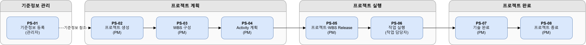
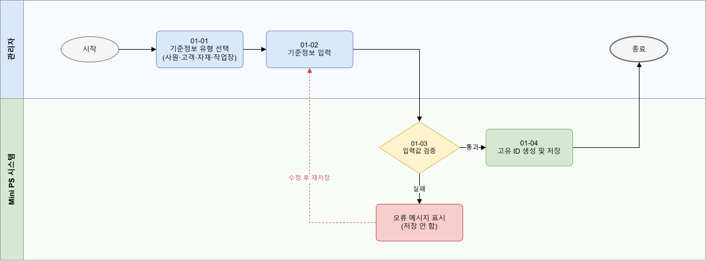
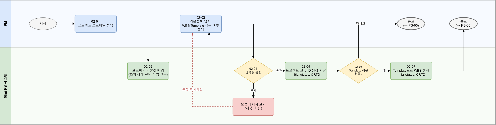
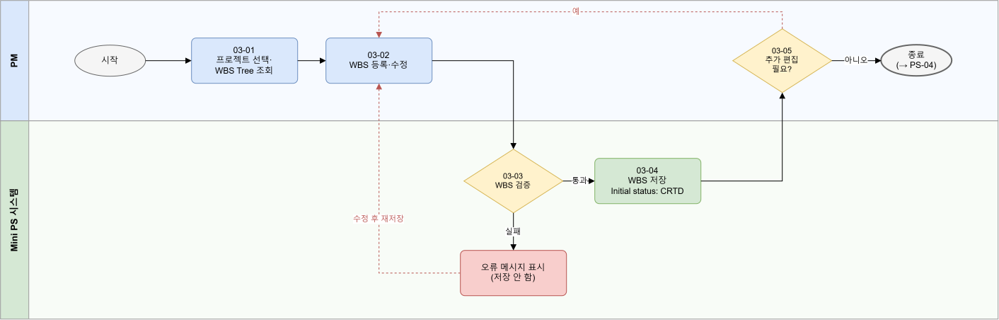
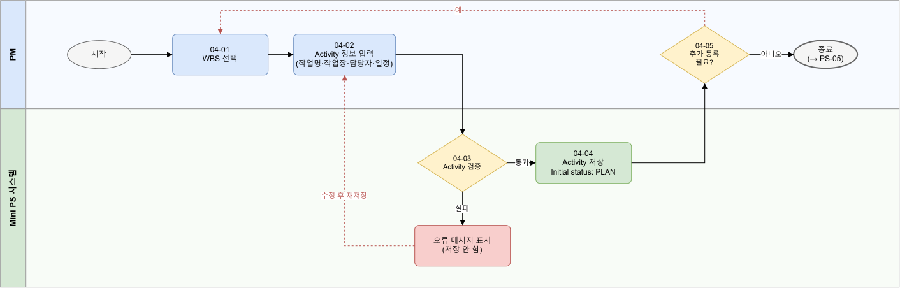
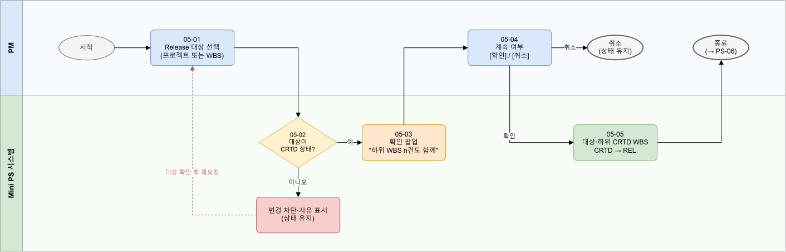
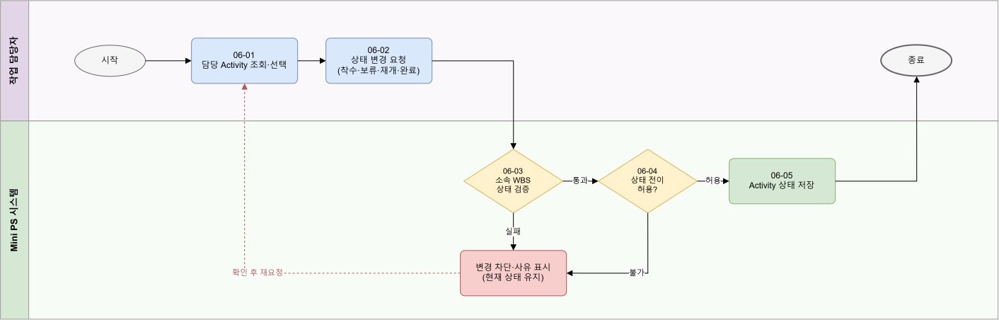
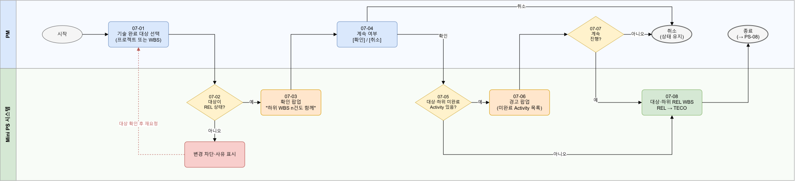
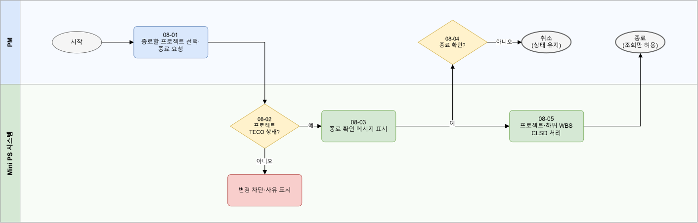

### 전체 프로세스 flow

### PS-01 기준정보 등록

- 01-03 검증: 필수값 입력, 코드값 Code Master 존재 여부, ID 중복 없음

### PS-02 프로젝트 생성

- 02-03: WBS Template 적용 체크박스
- 02-04 검증: 필수값 입력, 선박 타입 필수(Vessel Type Required=Y), 발주처·PM 존재, 시작일 ≤ 종료일
- 02-06~02-07: Template 적용을 선택했으면 Template으로 WBS 생성, 프로젝트와 함께 저장

### PS-03 WBS 구성

- 시작점: PS-02에서 Template을 적용하지 않았으면 처음부터 수동 구성, 적용했으면 생성된 WBS를 보완
- 03-03 검증
    - 프로젝트, 모든 상위 WBS의 상태: TECO·CLSD 아님
    - 상위 WBS가 같은 프로젝트 내 존재
    - WBS Level = 상위 Level + 1 
    - Tree 형태 유지(순환 금지)

### PS-04 Activity 계획

- 04-03 검증 
    - 프로젝트, WBS가 TECO/CLSD 아님
    - 작업장은 Work Center, 담당자는 Employee에 존재
    - 시작일 ≤ 종료일

### PS-05 프로젝트·WBS Release

- 05-01 
    - 프로젝트나 상위 WBS가 CRTD여도 먼저 착수할 하위 WBS만 골라 Release 가능(부분 Release)
- 05-02 검증
    - 대상이 CRTD
    - 프로젝트·상위 WBS가 TECO·CLSD인 범위는 차단
- 05-03 
    - 하위 WBS가 없으면 팝업 없이 05-05 
- 05-05
    - 대상과 하위 CRTD WBS가 자동으로 함께 REL (SAP 표준 상속)
    - 상위 WBS·프로젝트와 Activity 상태는 바뀌지 않음

### PS-06 작업 실행

- 06-03 검증
    - Activity가 속한 직속 WBS 상태만 확인 (상위 WBS·프로젝트는 보지 않음)
    - 착수/보류/재개 -> REL 상태여야 함
    - 완료 -> REL 또는 TECO
    - CLSD면 모두 차단

- 06-04 검증
    - Activity Status Transition에 존재하는 전이만 허용
        - PLAN→PROC(착수), PROC→HOLD(보류), HOLD→PROC(재개), PROC→COMP(완료)

### PS-07 기술 완료

- 07-02 검증
    - 대상이 REL
- 07-03 
    - 하위 WBS가 없으면 팝업 없이 07-05

- 07-05~07-07 
    - 미완료 Activity가 있으면 경고, 확인하면 진행

- 07-08 
    - 대상과 하위 REL WBS -> TECO
    - 하위 CRTD WBS는 변경 X (잠김, 이후 Release 불가)
    - 상위 WBS·프로젝트 상태는 그대로
    - 남은 Activity는 상태 유지, 진행 중인 것만 완료 가능
    - Activity 완료만으로 자동 TECO 되지 않음

### PS-08 프로젝트 종료

- 08-02 검증 
    - 프로젝트 상태 TECO
- 08-05 
    - 프로젝트와 하위 WBS 모두 CLSD, 이후 프로젝트·WBS·Activity는 조회만 가능
